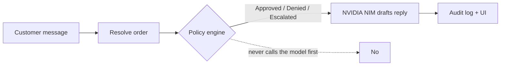

# Northline Care — AI Refund System

Policy-gated customer support refund assistant for **Northline Care**.

| Layer | Stack |
|-------|--------|
| Backend | FastAPI · deterministic policy engine · NVIDIA NIM |
| Frontend | React (Vite) · Support chat · Admin desk · Policy view |
| Data | Mock CRM with 17 orders + clear refund policy |
| Run | `docker compose up --build` |
| CI | Policy tests · API tests · frontend build |

**Core design rule:** Policy is applied in code **before** the language model. NVIDIA only writes the customer-facing reply and cannot override a Denied or Escalated decision.

> Reviewers: start with [REVIEW.md](REVIEW.md). One command, seven scenarios, ten minutes.

---

## Quick start

```bash
git clone https://github.com/Sammy-t3ch/northline-returns.git
cd northline-returns
cp .env.example .env
# Edit .env and set NVIDIA_API_KEY=nvapi-...
docker compose up --build
```

| Service | URL |
|---------|-----|
| Frontend | http://localhost:3000 |
| API docs | http://localhost:8000/docs |
| Health | http://localhost:8000/api/health |

Environment variables (see `.env.example`):

| Variable | Required | Description |
|----------|----------|-------------|
| `NVIDIA_API_KEY` | For live replies | NVIDIA NIM key (`nvapi-…`) |
| `NVIDIA_MODEL` | No | Defaults to `meta/llama-3.2-11b-vision-instruct` |

Without a valid key the system still runs: the policy engine decides, and a template reply is returned. **Do not commit a real key** — `.env` is gitignored.

Llama 3.1 / 3.3 instruct endpoints were retired on NVIDIA NIM (2026-08-26). The default model is a live chat-completions endpoint; vision is unused.

---

## Architecture

```text
Browser (React)
   │
   ▼
FastAPI
   ├─ 1. Load order from mock CRM
   ├─ 2. Deterministic policy engine  →  Approved | Denied | Escalated
   ├─ 3. NVIDIA NIM (reply generation only)
   └─ 4. In-memory audit log (admin desk)
```



### Policy rules (enforced in code)

- **30-day window** — older orders → Denied
- **Final-sale items** — fully final-sale cart → Denied
- **>$500 total** → Escalated (human review)
- **Damage / defect / wrong item** language → Escalated
- **Not yet delivered** (shipped / processing) → Escalated
- **Prompt-injection patterns** → Escalated
- Email / order mismatch or missing order → Denied

Order dates are stored as `days_ago` and resolved at load time so reviewer scenarios stay valid.

### AI role

NVIDIA NIM drafts a short, empathetic customer reply that **must** respect the policy decision. It cannot approve what the engine denied.

---

## Demo scenarios

Use the “Try a scenario” chips in the Support tab, or call the API directly.

| Scenario | Email / Order | Expected |
|----------|---------------|----------|
| Happy path | maya.chen@northline.test / ORD-1001 | **Approved** |
| Final sale | priya.sharma@northline.test / ORD-1009 | **Denied** |
| Too old | liam.brooks@example.com / ORD-1004 | **Denied** |
| Damage claim | carlos.mendez@example.com / ORD-1008 | **Escalated** |
| Over $500 | isabella.rossi@northline.test / ORD-1017 | **Escalated** |
| Still shipping | emma.wilson@northline.test / ORD-1007 | **Escalated** |
| Injection attempt | maya.chen@northline.test / ORD-1001 | **Escalated** |

Admin desk (Desk tab) shows the live audit log of decisions, reasons, and replies.

---

## API

| Method | Path | Purpose |
|--------|------|---------|
| `POST` | `/api/refund` | Process refund request `{ email, order_id?, message }` |
| `GET` | `/api/admin/requests` | Recent decisions + audit notes |
| `GET` | `/api/orders?email=` | List mock orders (optional filter) |
| `GET` | `/api/health` | Health + whether NVIDIA is configured |

Interactive docs: http://localhost:8000/docs

---

## Project structure

```text
northline-returns/
├── backend/
│   ├── app/
│   │   ├── data/           # orders.json + policy.md
│   │   ├── models/         # Pydantic schemas
│   │   ├── routers/        # /api/refund, admin, orders
│   │   └── services/       # policy_engine.py, nvidia_ai.py
│   ├── tests/test_api.py
│   ├── tests_policy.py
│   ├── requirements.txt
│   └── Dockerfile
├── frontend/
│   ├── src/components/     # ChatPanel, AdminDesk, PolicyView
│   └── Dockerfile
├── .github/workflows/ci.yml
├── docker-compose.yml
├── REVIEW.md
└── README.md
```

---

## Local development (without Docker)

```bash
# Backend
cd backend && pip install -r requirements.txt
export NVIDIA_API_KEY=nvapi-...
PYTHONPATH=. uvicorn app.main:app --reload --port 8000

# Frontend (new terminal)
cd frontend && npm install
export VITE_API_URL=http://localhost:8000
npm run dev
```

Tests:

```bash
make test
# or
cd backend && PYTHONPATH=. python tests_policy.py && PYTHONPATH=. pytest -q
```

---

## Assumptions & trade-offs

- Mock CRM is a static JSON file (17 orders). Sufficient for assessment; production would use a real DB.
- Audit log is in-memory and resets on restart — fine for demos.
- NVIDIA is used only for reply generation after a hard policy decision (safer than letting the model decide).
- Prompt-injection detection is pattern-based, not a full security layer.
- Public hosting (Render + Cloudflare) is optional; reviewers can run everything with Docker.

---

## Repo

https://github.com/Sammy-t3ch/northline-returns
